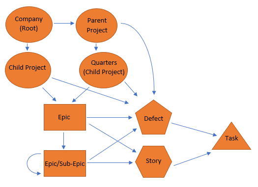

# VersionOne-Data-Extract
This program uses VersionOne API calls to extract valuable information on a company's projects, child projects, epics, stories, defects, and tasks. Use part one of the project to export the data into directories, sub-directories, and files or use part two of the project to export the data into an excel sheet. To run the program/main function, please provide a bearer authentication and your company's VersionOne domain. Depending of the amount of historical data selected to extract, the program may take a long time to run.

## VersionOne Data Extract Guide (part 2 excel-style)

\*\*\* The main function is already set up to run the extraction on all UDM data.

-
  - Open/Import the project (VersionOneDataExtraction as the root folder) and run the main method. Make sure to set bearerAuthToken and the company name/URL domain.
  - \*\*\* Make sure not to lock your computer or leave the project unattended; the project could freeze and stop extraction. The projects could take 3 hours to run. You can run both part 1 (directory) and part 2 (excel) at the same time for efficiency. Some of the data being extracted may not be needed or may not exist.

**Choose a Project or Child Project (Quarter) to run the extract on by calling the appropriate function with the item&#39;s ID passed as a parameter.**

-
  - The ID of the item can be found in VersionOne on the item&#39;s page.
    - Portfolio Tree -> Item -> Click on item name -> Click arrow on top right of the pop-up page -> Use the ID number in the URL after &quot;%3A&quot;
    - Example: [https://www5.v1host.com/Company/Project.mvc/Summary?oidToken=Scope%3A](https://www5.v1host.com/Company/Project.mvc/Summary?oidToken=Scope%3Axxxxxx)[xxxxxx](https://www5.v1host.com/Company/Project.mvc/Summary?oidToken=Scope%3Axxxxxx)
  - The optional functions to call are:

runExtractionOnProjectData(), runExtractionOnChildProjectData().

-
  -
    - Example: runExtractionOnProjectData(&quot;xxxxxx&quot;);
    - Note: when running against a project with only one level of child projects use the project function since there are child projects (quarters).
    - Note: use the child project function when there are no child projects under the project.
    - Note: use the project and child project functions on the different projects inside a parent project in addition to the project itself. Do this because the code does not recursively check for projects and only recognizes if a project is a parent with one child project level.
  - Data related to the chosen item will be extracted (more info. below).

**Project/Child Project sheet:**

-
  - The projects are in rows in the project or child project sheets and are named after the names of the Projects/Child Projects.
    - Example: &quot;Project&quot; or &quot;Project\_September\_2019&quot;
  - Project/ChildProject JSON object data is parsed into cells with the appropriate row and column which is where most information is coming from. Other JSON objects are created and parsed because the respective information was not included here.
  - CreateDate JSON and CreatedBy JSON column data.
  - ClosedDate JSON and ClosedBy JSON column data if it is closed.
  - Estimate PTS – Rollup JSON column data which does not match the Estimate PTS - Rollup shown in the UI under the project&#39;s page (even though it is calculated off the estimates correctly).

**Epic/Sub-Epic sheet:**

-
  - The epics are in rows in the epic sheet and are named with the Epic ID and are followed by the Epic name.
    - Example: &quot;E-xxxxx Epic\_Name&quot;
  - Epic JSON object data is parsed into cells with the appropriate row and column which is where most information is coming from. Other JSON objects are created and parsed because the respective information was not included here.
  - DoneDate JSON column data if done.
  - CreateDate JSON and CreatedBy JSON column data.
  - ClosedDate JSON and ClosedBy JSON column data if it is closed.
  - Estimate PTS – Rollup JSON column data which does not match the Estimate PTS - Rollup shown in the UI under the project&#39;s page (even though it is calculated off the estimates correctly).

**Story/Defect sheet:**

-
  - The stories and defects are I rows in the stories and defects sheet and their names start with the Story or Defect ID and are followed by the Story Defect name.
    - Example: &quot;B-xxxxx Story\_Name&quot; or &quot;D-xxxxx Defect\_Name&quot;
  - Story/Defect JSON object data is parsed into cells with the appropriate row and column which is where most information is coming from. Other JSON objects are created and parsed because the respective information was not included here.
  - AcceptanceCriteria JSON column data if it is a Story directory.
  - Total Detail Estimate JSON column data (calculated from Total Detail Estimates of Tasks).
  - Total Done Hours JSON column data (calculated from Task actual sums).
  - Total To Do Hours JSON column data (calculated from To Do Hours of Tasks).
  - DoneDate JSON column data if done.
  - CreateDate JSON and CreatedBy JSON column data.
  - ClosedDate JSON and ClosedBy JSON column data if it is closed.

**Task sheet:**

-
  - The tasks are in rows in the task sheet and their names start with the Task ID and are followed by the Task name.
    - Example: &quot;TK-xxxxxx Task\_Name&quot;
  - Task JSON object data is parsed into cells with the appropriate row and column which is where most information is coming from. Other JSON objects are created because the respective information was not included here.
  - Total Done Hours JSON column data which is the sum of all actual hour values.
  - Actual JSON column data which contain the different hours recorded for the task.
  - CreateDate JSON and CreatedBy JSON column data.
  - ClosedDate JSON and ClosedBy JSON column data if it is closed.

**Diagram:**

- Meta Data: [https://www5.v1host.com/Company/meta.v1](https://www5.v1host.com/Company/meta.v1)
- Developer Library: [https://community.versionone.com/VersionOne\_Connect/Developer\_Library](https://community.versionone.com/VersionOne_Connect/Developer_Library)

## VersionOne Data Extract Guide (part 1 directory-style)

\*\*\* The main function is already set up to run the extraction on all UDM data.

-
  - Open/Import the project (VersionOneDataExtraction as the root folder) and run the main method. Make sure to set bearerAuthToken and the company name/URL domain.
  - \*\*\* Make sure not to lock your computer or leave the project unattended; the project could freeze and stop extraction. The projects could take 3 hours to run. You can run both part 1 (directory) and part 2 (excel) at the same time for efficiency. Some of the data being extracted may not be needed or may not exist.

**Choose a Project, Child Project (Quarter), Epic, Sub-Epic, Story, Defect, or Task to run the extract on by calling the appropriate function with the item&#39;s ID passed as a parameter.**

-
  - The ID of the item can be found in VersionOne on the item&#39;s page.
    - Portfolio Tree -> Item -> Click on item name -> Click arrow on top right of the pop-up page -> Use the ID number in the URL after &quot;%3A&quot;
    - Example: [https://www5.v1host.com/Company/Project.mvc/Summary?oidToken=Scope%3A](https://www5.v1host.com/Company/Project.mvc/Summary?oidToken=Scope%3Axxxxxx)[xxxxxx](https://www5.v1host.com/Company/Project.mvc/Summary?oidToken=Scope%3Axxxxxx)
  - The optional functions to call are:

runExtractionOnProjectData(), runExtractionOnChildProjectData(), runExtractionOnEpicData(), runExtractionOnStoryData(), runExtractionOnDefectData(), runExtractionOnTaskData().

-
  -
    - Example: runExtractionOnProjectData(&quot;xxxxxx&quot;);
    - Note: when running against a project with only one level of child projects use the project function since there are child projects (quarters).
    - Note: use the child project function when there are no child projects under the project.
    - Note: use the project and child project functions on the different projects inside a parent project in addition to the project itself. Do this because the code does not recursively check for projects and only recognizes if a project is a parent with one child project level.
  - Data related to the chosen item will be extracted (more info. below).

**Project/Child Project directory:**

-
  - These folders are named after the names of the Projects/Child Projects.
    - Example: &quot;Project&quot; or &quot;Project\_ September \_2019&quot;
  - Contains Child Project directories if directory is a parent Project (UDM contains quarters). Contains Epic directories, and Story/Defect directories if there are any Stories or Defects that do not belong to an Epic in that Project.
  - Project/ChildProject .json file which is where most information is stored. Other files are created because the respective information was not included here.
  - CreateDate.json and CreatedBy.json files.
  - ClosedDate.json and ClosedBy.json files if it is closed.
  - Estimate PTS – Rollup.json file which does not match the Estimate PTS - Rollup shown in the UI under the project&#39;s page (even though it is calculated off the estimates correctly).

**Epic/Sub-Epic directory:**

-
  - These folder names start with the Epic ID and are followed by the Epic name.
    - Example: &quot;E-xxxxx Epic\_Name&quot;
  - Contains Epic/Sub-Epic/Story/Defect directories.
  - Epic .json file which is where most information is stored. Other files are created because the respective information was not included here.
  - DoneDate.json file if done.
  - CreateDate.json and CreatedBy.json files.
  - ClosedDate.json and ClosedBy.json files if it is closed.
  - Estimate PTS – Rollup.json file which does not match the Estimate PTS - Rollup shown in the UI under the project&#39;s page (even though it is calculated off the estimates correctly).

**Story/Defect directory:**

-
  - These folder names start with the Story or Defect ID and are followed by the Story Defect name.
    - Example: &quot;B-xxxxx Story\_Name&quot; or &quot;D-xxxxx Defect\_Name&quot;
  - Contains Task directories.
  - Story/Defect .json file which is where most information is stored. Other files are created because the respective information was not included here.
  - AcceptanceCriteria.json file if it is a Story directory.
  - Total Detail Estimate.json file. (calculated from Total Detail Estimates of Tasks)
  - Total Done Hours.json file. (calculated from Task actual sums)
  - Total To Do Hours.json file. (calculated from To Do Hours of Tasks)
  - DoneDate.json file if done.
  - CreateDate.json and CreatedBy.json files.
  - ClosedDate.json and ClosedBy.json files if it is closed.

**Task directory:**

-
  - These folder names start with the Task ID and are followed by the Task name.
    - Example: &quot;xxxxxx Task\_Name&quot;
  - Task .json file which is where most information is stored. Other files are created because the respective information was not included here.
  - Total Done Hours.json file which is the sum of all actual hour values.
  - Actual .json files which contain the different hours recorded for the task.
  - CreateDate.json and CreatedBy.json files.
  - ClosedDate.json and ClosedBy.json files if it is closed.

**Diagram:**

- Meta Data: [https://www5.v1host.com/Company/meta.v1](https://www5.v1host.com/Company/meta.v1)
- Developer Library: [https://community.versionone.com/VersionOne\_Connect/Developer\_Library](https://community.versionone.com/VersionOne_Connect/Developer_Library)
